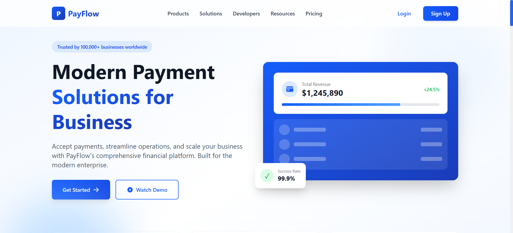

# PayFlow - Modern Fintech Landing Page

A beautiful, responsive landing page inspired by Razorpay's design approach, built with React and Tailwind CSS. Features a clean white and blue color scheme with smooth animations and modern UI components.



## 🚀 Features

- **Responsive Design** - Fully optimized for mobile, tablet, and desktop devices
- **Modern UI Components** - Clean, professional components including:
  - Sticky Navigation with mobile menu
  - Animated Hero section with statistics
  - Feature showcase cards
  - Product highlights with alternating layouts
  - Testimonials carousel with auto-rotation
  - Comprehensive footer with newsletter signup
- **Smooth Animations** - Powered by Framer Motion for delightful user interactions
- **Performance Optimized** - Built with Vite for lightning-fast development and production builds
- **Clean Code Structure** - Modular component architecture for easy maintenance

## 🛠️ Tech Stack

- **Framework:** React 19.2.0
- **Build Tool:** Vite 7.2.4
- **Styling:** Tailwind CSS 4.1.17
- **Animations:** Framer Motion
- **Icons:** React Icons
- **Language:** JavaScript (ES6+)

## 📦 Installation

### Prerequisites

- Node.js (v20.19.0 or >=22.12.0 recommended)
- npm (v10.8.2 or higher)

### Setup Instructions

1. **Clone the repository**
   ```bash
   git clone <repository-url>
   cd fintechwebsite
   ```

2. **Install dependencies**
   ```bash
   npm install
   ```

3. **Start development server**
   ```bash
   npm run dev
   ```
   The application will open at `http://localhost:5173`

4. **Build for production**
   ```bash
   npm run build
   ```

5. **Preview production build**
   ```bash
   npm run preview
   ```

## 📁 Project Structure

```
fintechwebsite/
├── public/
│   └── vite.svg
├── src/
│   ├── components/
│   │   ├── Navbar.jsx          # Sticky navigation with mobile menu
│   │   ├── Hero.jsx            # Hero section with animations
│   │   ├── Features.jsx        # Features showcase grid
│   │   ├── ProductHighlights.jsx # Product highlights section
│   │   ├── Testimonials.jsx    # Testimonials carousel
│   │   └── Footer.jsx          # Footer with newsletter
│   ├── assets/
│   │   └── react.svg
│   ├── App.jsx                 # Main application component
│   ├── App.css                 # Component-specific styles
│   ├── index.css               # Global styles & Tailwind import
│   └── main.jsx                # Application entry point
├── index.html
├── package.json
├── vite.config.js
├── eslint.config.js
└── README.md
```

## 🎨 Color Scheme

The landing page uses a professional white and blue color palette:

- **Primary Blue:** `#0066FF`, `#0052CC`, `#003D99`
- **White/Gray:** `#FFFFFF`, `#F8FAFC`, `#E2E8F0`
- **Accent:** `#60A5FA`, `#3B82F6`
- **Text:** `#1E293B`, `#475569`

## 🧩 Components Overview

### Navbar
- Sticky positioning with scroll-based background change
- Responsive mobile hamburger menu with smooth animations
- Logo with gradient styling
- CTA buttons (Login & Sign Up)

### Hero Section
- Eye-catching headline with gradient text
- Dual CTA buttons (Get Started & Watch Demo)
- Animated statistics cards (Transactions, Businesses, Countries)
- Interactive dashboard mockup with progress bars
- Floating success rate badge

### Features Section
- 6 feature cards in responsive grid layout
- Icons with gradient backgrounds
- Hover effects with smooth transitions
- Scroll-triggered animations
- Payment Gateway and Business Banking highlights

### Product Highlights
- Alternating left/right image layouts
- Detailed feature lists with checkmarks
- Visual mockups with live status indicators
- Gradient-themed sections for each product
- Lightning-Fast Checkout, Enterprise Security, Smart Insights

### Testimonials
- Auto-rotating carousel with 5-second intervals
- Customer testimonials with ratings
- Navigation arrows and dot indicators
- Trusted company logos grid
- Smooth slide animations

### Footer
- Newsletter subscription section
- Multi-column link organization (Products, Company, Resources, Legal)
- Contact information with icons
- Social media links with hover animations
- Payment methods showcase
- Compliance certifications (PCI-DSS, ISO 27001, SOC 2)

## 🎯 Key Highlights

✅ **Responsive Design** - Mobile-first approach with breakpoints for all devices
✅ **Smooth Animations** - Framer Motion for scroll triggers and hover effects
✅ **Modern Gradients** - Beautiful gradient backgrounds and text effects
✅ **Clean Component Structure** - Reusable and maintainable code
✅ **Optimized Performance** - Fast loading with Vite's build optimization
✅ **Accessibility** - Semantic HTML and proper ARIA attributes

## 🚀 Deployment

### Deploy to Vercel

1. Install Vercel CLI
   ```bash
   npm install -g vercel
   ```

2. Deploy
   ```bash
   vercel
   ```

### Deploy to Netlify

1. Build the project
   ```bash
   npm run build
   ```

2. Deploy the `dist` folder to Netlify

## 📝 Available Scripts

- `npm run dev` - Start development server with hot reload
- `npm run build` - Build optimized production bundle
- `npm run preview` - Preview production build locally
- `npm run lint` - Run ESLint for code quality checks

## 🔧 Configuration

### Vite Configuration
Located in `vite.config.js` - includes React plugin and Tailwind CSS integration.

### ESLint Configuration
Located in `eslint.config.js` - follows React best practices and modern standards.

### Tailwind CSS
Configured via `@import "tailwindcss"` in `index.css` using Tailwind CSS v4 approach.

## 🤝 Contributing

Contributions are welcome! Please feel free to submit a Pull Request.

## 📄 License

This project is created as part of an assignment and is available for educational purposes.

## 👨‍💻 Developer

Created with ❤️ for the Razorpay-Style Landing Page Assignment

---

**Deadline:** November 24, 2025
**Project Type:** Web Only (Responsive Landing Page)
**Reference:** Inspired by Razorpay's homepage design approach
